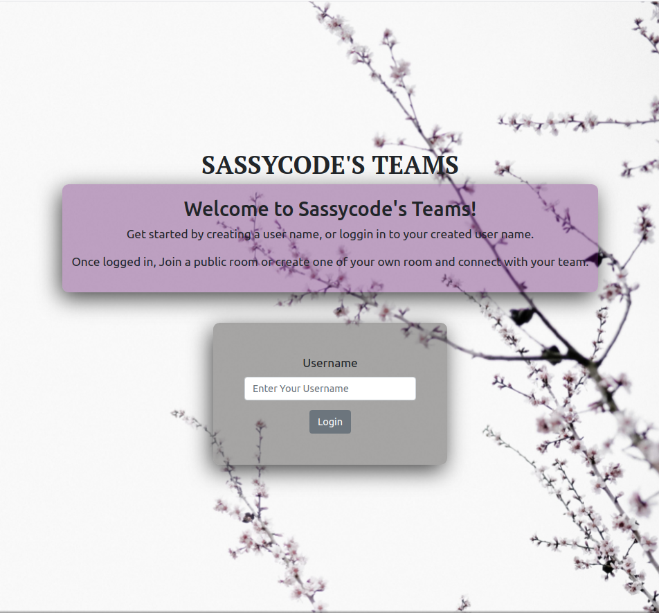
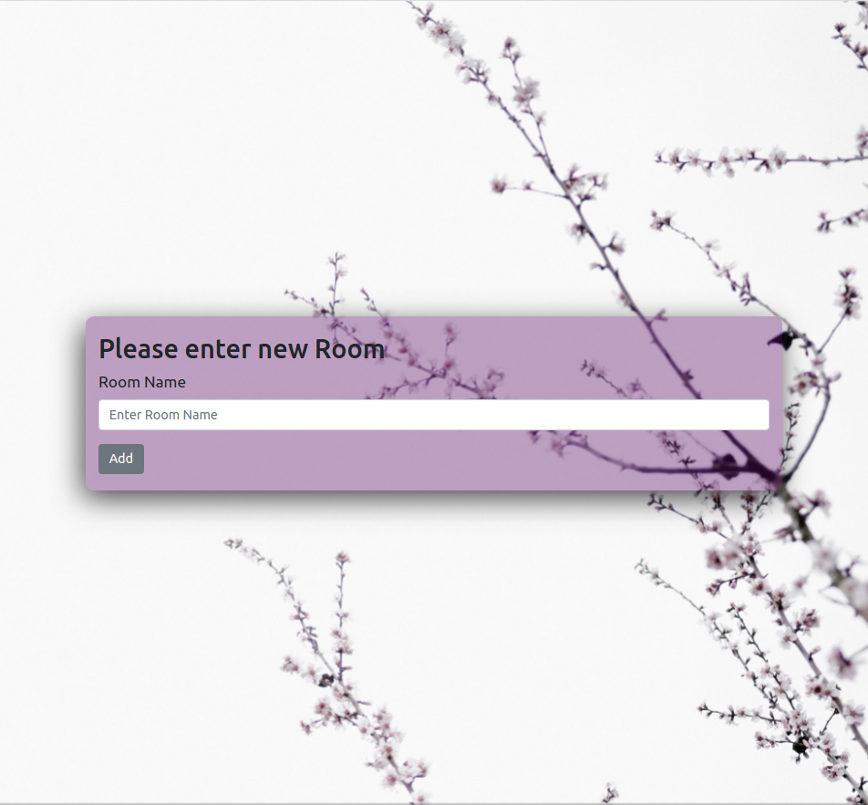
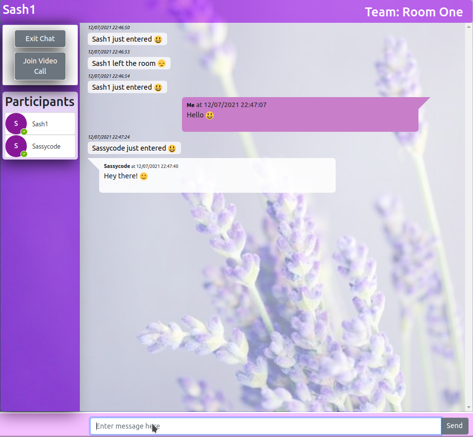
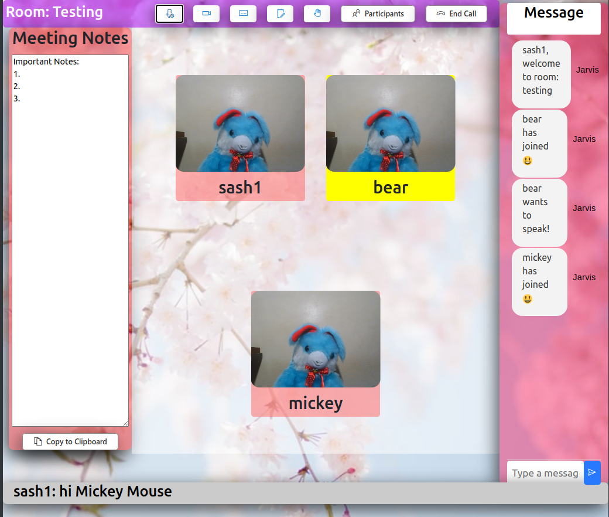

# PolyChat AKA Sassycode's Teams

A public messaging and meeting platform to connect to individuals


## Features

- [X] User login
- [X] Creating and joining public teams channels
- [X] Real-time speech-to-text transcription
- [X] In-call messaging
- [X] Teams chatting before and after the call
- [X] Collaborative meeting notes
- [X] Enabling/disabling microphone 
- [X] Enabling/disabling camera
- [X] Raising/Lowering hand to speak in meeting
- [ ] Screen Sharing
- [ ] Collaborative white board

    
## Installation

Install polychat with npm

Clone this repository with :
```bash
git clone ""
```

Installing Server Side dependecies. Go to root folder.

```bash
  cd server
  npm install
  npm start
```

Installing Client/ Frontend Side dependecies in a new terminal window. Go to root folder.
```bash
  cd client
  npm install
  npm start
```
    
## Tech Stack

**Client:** React, React Hooks, Firebase - Realtime Database, Simple-Peer, FluentUI

**Server:** Node, Express, Socketio


## Screenshots

Login Page



Add Room Page



Room List Page


Chat Room



Video Call Room

  